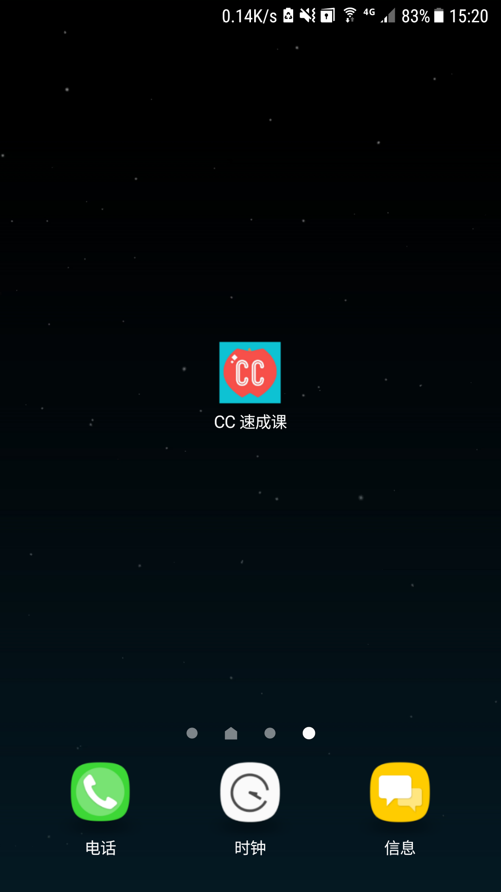
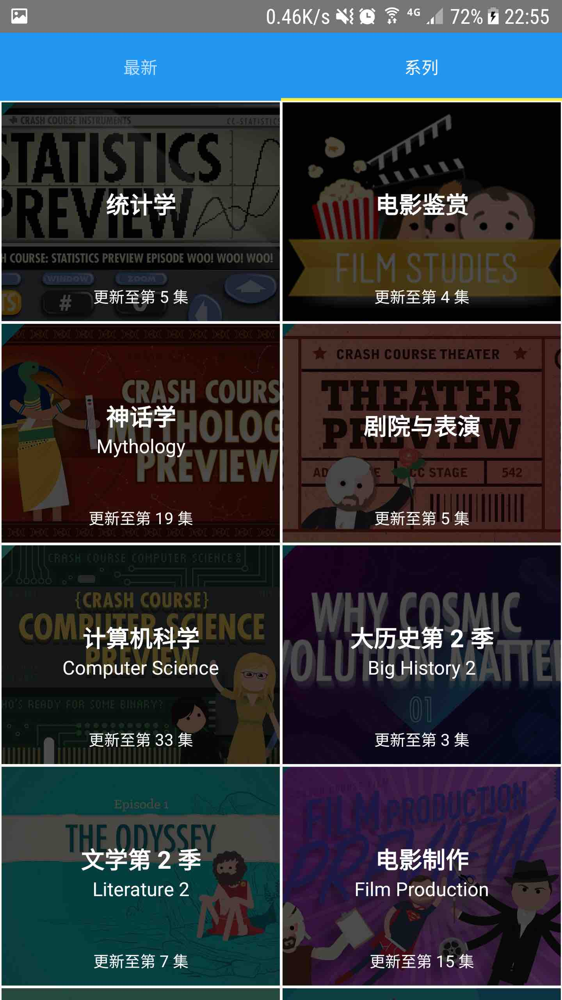

## 应用名称：CC 速成班
CC 是 Crash Course 的缩写。是 Youtube 上的一个教育类频道。

### 介绍
这是个安卓 App    
App 打开是有中文字幕的 Crash Course 视频 (字幕组自己维护 App 内容)     
点击会跳转到B站, 推荐同时安装B站的 App 搭配使用。             

### 下载地址
* Android: [酷安应用市场](https://www.coolapk.com/apk/147390)
* iOS: [无法过审](https://github.com/1c7/CrashCourse-iOS-App)

### 应用截图1

### 应用截图2

### 视频演示
https://www.bilibili.com/video/av13236166/